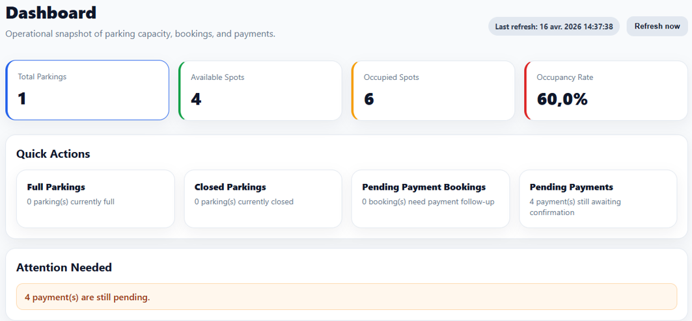
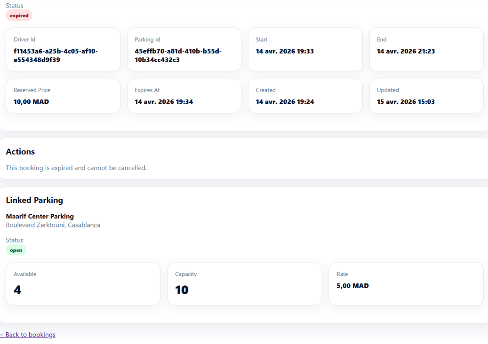
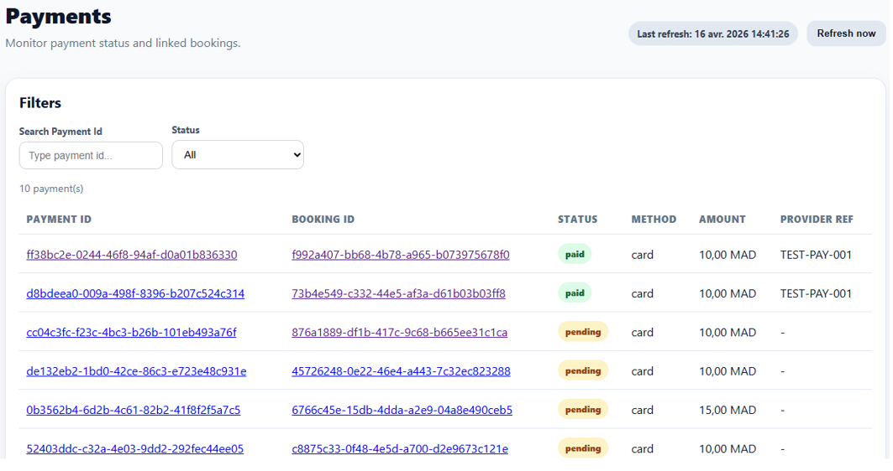
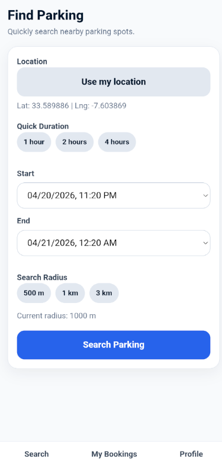
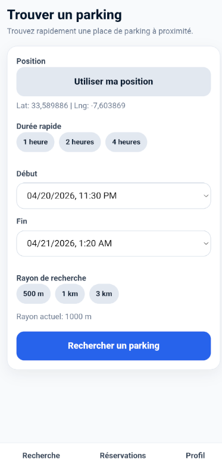
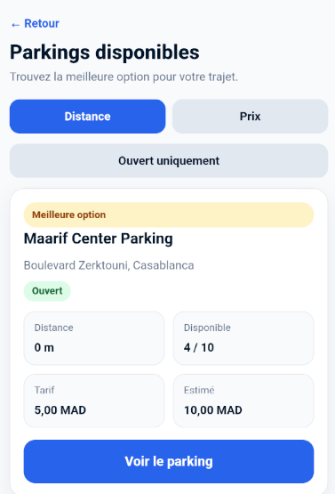
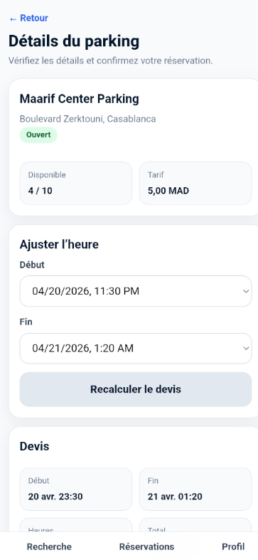
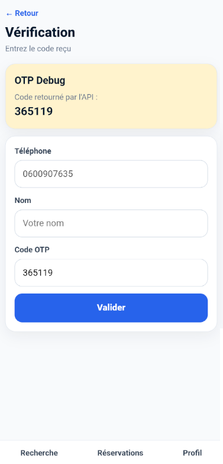

# 1. SmartParking SaaS

Real-time parking reservation platform built with .NET 8, Blazor, MAUI, and PostgreSQL.

---

## 2. Highlights

- Real-time availability management (no overbooking)
- Full booking lifecycle (Pending → Active → Completed → Expired → Cancelled)
- Payment handling (Pending / Paid)
- Operator dashboard (KPIs + quick actions)
- Mobile-first driver experience
- Full internationalization (EN / FR) on mobile app
- Culture-safe API integration (InvariantCulture handling)

---

## 3. Overview

SmartParking is a SaaS platform designed to manage parking reservations in real time.

It focuses on solving real-world problems such as:
- preventing overbooking
- handling pending payments
- managing parking capacity
- providing an operational dashboard for monitoring and actions

---

## 4. Architecture Overview

This project follows a modular architecture inspired by Clean Architecture principles:

- Domain-driven design for business rules
- Application layer for use cases and handlers
- Infrastructure layer for persistence (EF Core)

Separate UI layers:
- Blazor Server (Operator Dashboard)
- MAUI Blazor Hybrid (Driver App)

The system is designed to be:
- scalable
- maintainable
- ready for real-time extensions (SignalR)

---

## 5. Domain Challenges

This project is not a simple CRUD application.

It addresses real-world constraints:

- Preventing overbooking under concurrent requests
- Managing pending vs confirmed payments
- Handling booking lifecycle transitions safely
- Keeping parking availability consistent at all times

---

## 6. Technical Stack

- .NET 8 / ASP.NET Core Web API
- Blazor Server (Admin UI)
- .NET MAUI Blazor Hybrid (Mobile)
- Entity Framework Core
- PostgreSQL

---

## 7. Features

### 7.1 Driver (Mobile)

- Search nearby parking
- View availability in real time
- Reserve a parking spot
- Payment flow
- OTP-based authentication (phone)
- Language switching (EN / FR)

### 7.2 Operator (Admin)

- Dashboard with KPIs
- Booking lifecycle management
- Parking availability management
- Payment monitoring
- Quick actions (cancel, complete, expire)

---

## 8. Screenshots

### 8.1 Operator Dashboard


### 8.2 Booking Details



### 8.3 Payments


### 8.5 Mobile - Search (EN)


### 8.6 Mobile - Search (FR)


### 8.7 Mobile - Results


### 8.8 Mobile - Booking Details


### 8.9 Mobile - OTP


---

## 9. Why this project matters

This project demonstrates the design of a real SaaS system:

- not just UI or CRUD
- but full product thinking
- domain modeling
- operational workflows
- handling real-world internationalization issues (culture, formatting, API consistency)

It reflects how production systems are built in practice.

---

## 10. Current Status

Work in progress.

Main features implemented:
- Search and booking flow
- Operator dashboard (KPIs + quick actions)
- Booking admin actions (cancel, complete, expire)
- Auto-refresh with filters and URL synchronization

---

## 11. Next Steps

- SignalR real-time updates
- Payment reconciliation improvements
- Advanced filtering and analytics
- Anti-fraud patterns (future extension)

---

## 12. Internationalization (Mobile)

The mobile application includes a complete internationalization (i18n) layer supporting English and French.

### 12.1 Key Capabilities

- Full UI localization using IStringLocalizer
- Runtime language switching from Profile page
- Language persistence using MAUI Preferences
- Culture initialization at application startup

### 12.2 Status Translation

API responses return raw domain values such as:

open, pending_payment, confirmed

These are translated on the client side using a centralized StatusMapper.

This approach ensures:

- separation between API data and UI labels
- consistent translations across the app
- correct styling based on raw status values

### 12.3 Culture-Safe API Integration

A critical issue was identified during development:

Under French culture, search queries returned no results due to incorrect number formatting.

Example:

33,589886 (FR) instead of 33.589886 (expected)

### Solution

All query parameters are now formatted using:

```csharp
CultureInfo.InvariantCulture

This guarantees consistent API behavior regardless of the current UI culture.

12.4 Supported Languages
English (default)
French
13. Design Decisions
13.1 OTP-based Authentication

The mobile application uses OTP (phone-based authentication) instead of traditional credentials.

Rationale:

frictionless onboarding
no password management
suitable for mobile-first usage
13.2 Stateless Mobile Session

Driver identity is persisted, but authentication is not automatically restored.

Rationale:

improved security
explicit user validation via OTP
simplified session lifecycle
13.3 StatusMapper Pattern

Domain statuses are not translated directly in UI components.

Instead, a centralized StatusMapper is used.

Rationale:

single source of truth
consistent translation across components
separation of concerns (domain vs presentation)
13.4 Culture-Invariant API Communication

All API query parameters use CultureInfo.InvariantCulture.

Rationale:

prevent culture-specific bugs (decimal, date formatting)
ensure consistent backend behavior
critical for internationalized applications
14. Author

Rachid Bariz
Senior Full-Stack .NET Architect
Product-driven engineer building SaaS platforms

15. Présentation (FR)

SmartParking est une plateforme SaaS de réservation de parking en temps réel.

Elle permet de gérer des problématiques métier concrètes :

éviter le surbooking
gérer les paiements en attente
contrôler la capacité des parkings
fournir un dashboard opérateur exploitable
16. Concepts clés
Gestion de disponibilité en temps réel
Cycle de vie des réservations
Gestion des paiements (Pending / Paid)
Dashboard opérateur (cockpit)
Expérience mobile côté utilisateur
17. Architecture
Backend : ASP.NET Core Web API (.NET 8)
Application : Clean Architecture
Domaine : règles métier
Infrastructure : EF Core
Admin : Blazor Server
Mobile : .NET MAUI Blazor Hybrid
Base de données : PostgreSQL
18. Fonctionnalités
18.1 Driver (Mobile)
Recherche de parking
Visualisation de la disponibilité
Réservation
Paiement
Authentification OTP
Changement de langue (FR / EN)
18.2 Opérateur (Admin)
Dashboard KPI
Gestion des réservations
Gestion des parkings
Suivi des paiements
Actions rapides
19. Points forts

Ce projet traite de vrais sujets métier :

gestion des conflits de réservation
synchronisation disponibilité / paiement
gestion de capacité en temps réel
gestion multi-langue et contraintes culturelles
20. Statut

Projet en cours de développement.

Fonctionnalités principales déjà en place :

recherche + réservation
dashboard opérateur
actions admin sur bookings
auto-refresh et filtres avancés
21. Prochaines étapes
SignalR temps réel
amélioration des paiements
analytics avancés
extension anti-fraude
22. Auteur

Rachid Bariz
Architecte logiciel .NET Senior
Approche orientée produit et SaaS